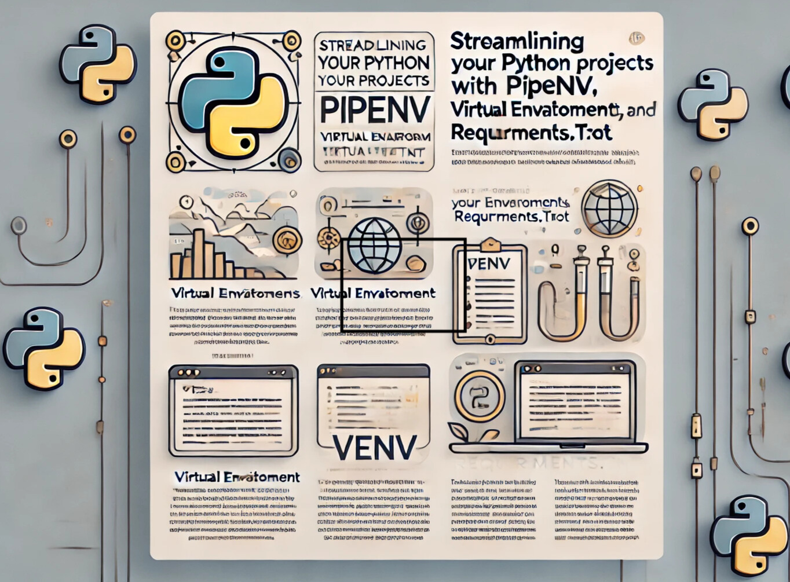
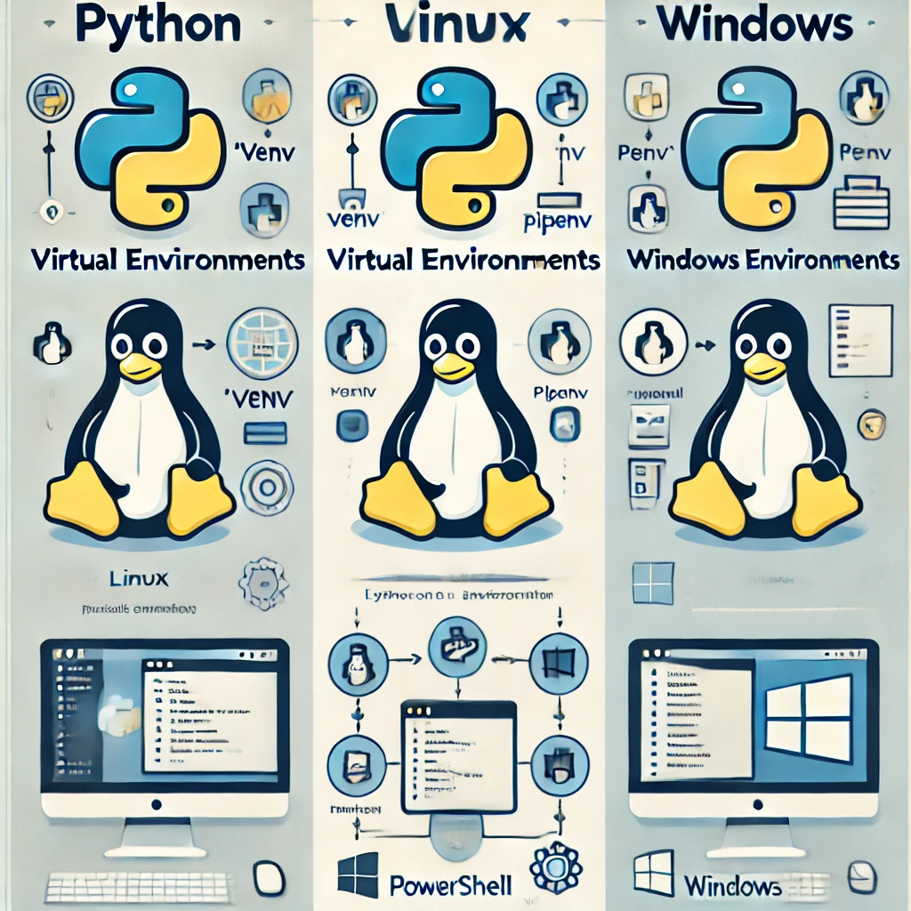

# Python Layihələrinizi Sadələşdirin: Pipenv, Virtual Ərtaf Mühitləri (venv) və Requirements.txt

Python programçı olaraq qarşılaşdığımız əsas çətinliklərdən biri dependensləri idarə etmək və layihələrimizin mütəlif sistemlərdə problemsiz işləməsini təmin etməkdir. Pipenv və Virtual Ərtaf Mühitlər (venv) kimi alətlər bu prosesi sadələşdirmək üçün çox faydalıdır.

## 1. Pipenv ilə Virtual Ərtaf Mühit Yaratmaq və Aktivləşdirmək

**Pipenv** aləti, Python layihələri üçün virtual ətraf mühitlər yaratmağı və dependensləri idarə etməyi asanlaşdırır.

### Pipenv-i Quraşdırın

```bash
pip install pipenv | pip3 install pipenv
```

### Virtual Ərtaf Mühit Yaradın və Aktivləşdirin

```bash
pipenv --python | pipenv shell | python pipenv shell 
```

Artıq (venv) olunmuş bir mühitdə işləyirsiniz.



## 2. Pipenv ilə Package Yükləmək 

Paket yükləmək üçün:

```bash
pipenv install < package_name >
```

Asılılıqlar **Pipfile** və **Pipfile.lock** fayllarında saxlanılacaq.

## 3. Requirements.txt Faylını  Yaratmaq

Requirements.txt faylı yaratmaq üçün:

```bash
pipenv lock --requirements > requirements.txt
```

Sonra bu fayldan istifadə edərək:

```bash
pip install -r requirements.txt
```

## 4. venv ilə Alternativ Virtual Ərtaf Mühit Qurmaq

### Virtual Ərtaf Mühit Yaradın

```bash
python -m venv venv
```

### Aktivləşdirin

**macOS/Linux:**

```bash
source venv/bin/activate | pipenv shell
```

**Windows:**

```bash
venv\Scripts\activate | activate
```




## Niyə Pipenv və ya venv?

- **Exstra ❗ :** Layihələrinizi qlobal Python paketlərindən ayırır.
- **Library Shearing 🚢 :** Pipfile və ya requirements.txt istifadə edərək eyni Ərtaf mühiti başqaları yarada bilər.
- **Eco Cleanup ♻️ :** Geniş qlobal quraşdırmalardan qaçın.

### Xüsusi Etiketlər:

#Python🐍 #Pipenv #VirtualEnvironment #venv #Proqramçılıq
